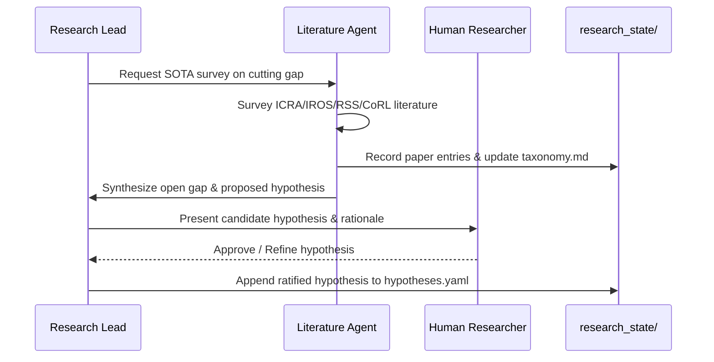

# Workflow 01: Literature Survey to Falsifiable Hypothesis

## Objective
Identify a validated scientific gap in the robotic cutting / DOM literature and formalize it into a falsifiable hypothesis in `research_state/hypotheses.yaml`.

## Step-by-Step Procedure
1. **Trigger**: Research Lead identifies an unverified domain assumption or new literature release.
2. **Execution**: `literature_agent` performs taxonomy lookup, notes limitations in existing papers, and flags potential novelty.
3. **Synthesis**: Draft hypothesis stating exact independent variables, dependent metrics, and falsification condition.
4. **Approval Gate**: Human researcher reviews and approves before hypothesis is logged as active.
