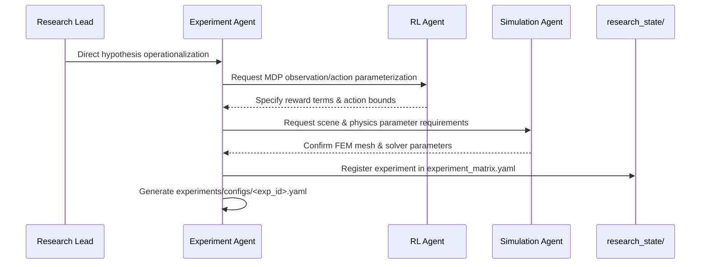

# Workflow 02: Hypothesis to Experiment Configuration

## Objective
Convert an approved hypothesis into a fully specified experimental design, baseline comparisons, ablation studies, and runnable YAML configuration.

## Step-by-Step Procedure
1. **Trigger**: New hypothesis ratified in `research_state/hypotheses.yaml`.
2. **Design**: `experiment_agent` establishes:
   - Control vs treatment conditions.
   - 4 required baselines (open-loop kinematic, fixed impedance, no-tactile, no-residual).
   - Seed schedule ($N = 5$ random seeds).
3. **Configuration**: Save runnable Hydra config in `experiments/configs/<exp_id>.yaml`.
4. **Registration**: Append unique `exp_id` to `research_state/experiment_matrix.yaml` with status `PLANNED`.
