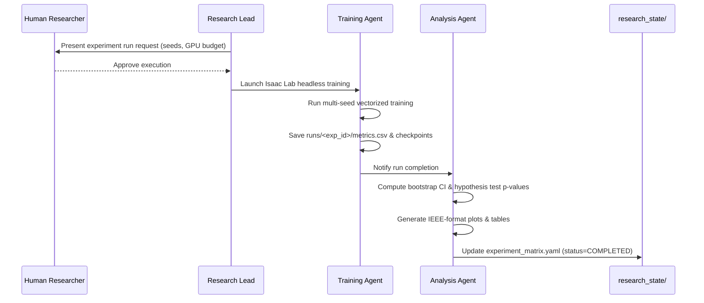

# Workflow 03: Training Execution to Statistical Analysis Pipeline

## Objective
Safely launch and monitor Isaac Lab headless training runs on GPU, collect telemetry, and produce statistical analyses and plots.

## Step-by-Step Procedure
1. **Safety Approval**: Training Agent presents resource requirements (VRAM budget, estimated run time) for Human Researcher sign-off.
2. **Headless Execution**: Execute run using Isaac Lab python wrapper (`./isaaclab.sh -p ... --headless`).
3. **Artifact Isolation**: Store full telemetry (`metrics.csv`, `config.yaml`, `git_commit.txt`) in isolated directory `experiments/runs/<exp_id>/`.
4. **Statistical Evaluation**: `analysis_agent` loads all seed runs, performs significance testing against baselines, and generates figures in `experiments/results/plots/`.
