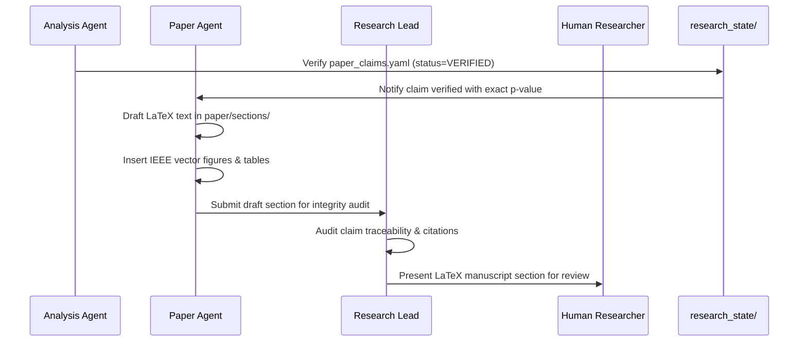

# Workflow 04: Experiment Results to Paper Manuscript

## Objective
Convert verified experimental data into publication-ready IEEE conference sections, ensuring zero-hallucination claim traceability.

## Step-by-Step Procedure
1. **Audit Gate**: `paper_agent` runs `python scripts/research_cli.py verify-claims` to confirm all referenced claims are marked `VERIFIED`.
2. **Manuscript Drafting**: Draft text directly into `paper/sections/06_results.tex` referencing exact experiment IDs and metrics.
3. **Figure Integration**: Link vector plots from `paper/figures/` and cross-reference table labels.
4. **Human Review**: Human researchers review text, figure aesthetics, and narrative clarity before final compilation.
