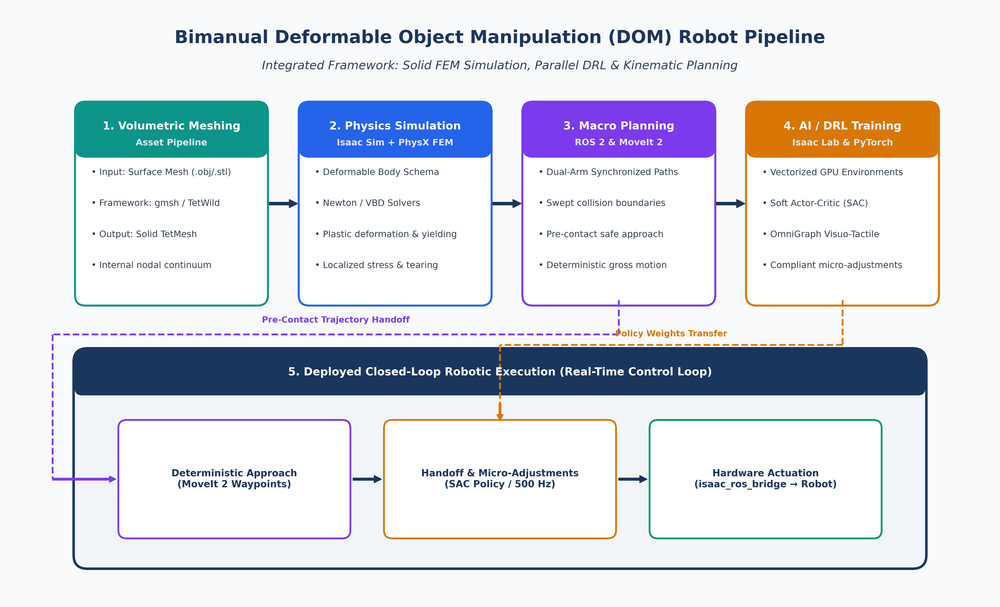

# Weekly Research Progress Report: Bimanual DOM Pipeline

**Project:** Autonomous Bimanual Soft-Body Slicing (DOM — Dual Robot Arms)  
**Authors:** Ahmed & Shahd  
**Affiliation:** DEX-ROB Lab, School of Electrical & Automation Engineering, Tianjin University  
**Advisor:** Prof. Shan An (安山)  
**Date:** September 20, 2026  

---

## 1. Executive Summary

This week, we focused on establishing the complete software-to-hardware architecture for our autonomous bimanual deformable object manipulation (DOM) project, verifying baseline simulation in **NVIDIA Isaac Sim** and **Isaac Lab**, and benchmarking hardware performance under deformable physics loads.

We completed the system pipeline design spanning 3D volumetric meshing, PhysX FEM deformable physics, dual-arm kinematic coordination via MoveIt 2, and policy learning via Soft Actor-Critic (SAC). We also conducted a comparative evaluation between Isaac Lab and MuJoCo, validating Isaac Lab as our primary engine for GPU-accelerated RL while positioning MuJoCo for Phase 2 imitation learning baselines. During initial parallel simulation runs, we identified a critical host memory bottleneck on our workstation (16 GB RAM), which leads to disk swap thrashing and Out-Of-Memory (OOM) crashes. Resolving this memory limit is our top operational priority to enable stable policy training next week.

---

## 2. Bimanual DOM System Architecture

To coordinate the stabilizing manipulator and the cutting end-effector while accounting for soft-body yielding and tearing, we designed an end-to-end 5-stage architecture:

### Core Software Stack

| Component Layer | Responsibility | Framework / Toolchain | Implementation Role |
|:---|:---|:---|:---|
| **Volumetric Meshing** | Solid TetMesh generation | `gmsh` / `TetWild` | Converts hollow surface models into solid tetrahedral meshes. |
| **Physics Simulation** | Tearing & deformation | `Isaac Sim` & `PhysX FEM` | Simulates nonlinear soft-body elasticity and tearing via Newton/VBD solvers. |
| **Macro Planning** | Dual-arm gross motion | `ROS 2 (Jazzy)` & `MoveIt 2` | Generates deterministic, collision-free pre-contact trajectories. |
| **AI / DRL Policy** | Parallel simulation training | `Isaac Lab` & `PyTorch` | Runs parallel GPU environments to train compliant manipulation policies. |
| **RL Algorithm** | Micro-force adjustments | `Soft Actor-Critic (SAC)` | Optimizes continuous joint adjustments for stable, non-crushing slicing. |
| **Sensory Feedback** | Visuo-tactile state feed | `OmniGraph` (Omniverse) | Extracts real-time normal/shear contact forces and camera streams. |
| **Hardware Bridge** | Real-time command dispatch | `isaac_ros_bridge` / `ros2_control` | Transmits joint target commands from policy to the physical robot. |

### Simulator Platform Evaluation: Isaac Lab vs. MuJoCo

To ground our simulation choice in our project requirements, we evaluated **Isaac Lab (Unified GPU)** against **MuJoCo / MuJoCo + Isaac Sim (Hybrid)** across our two research phases:

| Dimension | 🟩 Isaac Lab (Selected for Phase 1 RL) | 🔵 MuJoCo / MuJoCo + Isaac Sim (Hybrid) | Project Rationale & Context |
|:---|:---|:---|:---|
| **Architecture** | Unified single-process GPU pipeline (PhysX 5/FEM + PyTorch tensors). | Dual-process hybrid (MuJoCo CPU physics synced to Isaac Sim GPU render). | Isaac Lab eliminates CPU-GPU PCIe transfers and IPC bottlenecks during policy rollouts. |
| **RL Training Throughput** | **Very High** (1,000–4,096 parallel GPU envs; 10×–100× faster rollouts). | **Moderate to Low** (CPU thread bound; IPC synchronization overhead). | Critical for sample-intensive continuous SAC training on dual arms. |
| **Deformable & Tearing Physics** | **Native PhysX FEM** (TetMesh tetrahedralization & mesh cutting). | **Approximate / Rigid-body** (no native volumetric FEM tearing). | Essential for modeling knife penetration and soft tissue yielding. |
| **Contact Dynamics** | Penalty-based contact approximation (PhysX 5). | **Gold Standard** (analytical complementarity contact solver). | MuJoCo offers higher fidelity for rigid contacts, but lacks FEM tearing. |
| **IL & VLA Compatibility** | Growing (OmniHLS, GROOT, Isaac Lab Mimic). | **Dominant Standard** (native ALOHA, ACT, Diffusion Policy ecosystem). | MuJoCo remains our reference platform for future Phase 2 imitation learning. |
| **Sim-to-Real Transfer** | Built-in GPU domain randomization (friction, mass, visual). | Requires manual randomization bridges across both engines. | Streamlines direct zero-copy policy deployment to physical arms. |

**Strategic Verdict for Our Research:**
* **Phase 1 (Current — Autonomous Compliant Slicing via DRL):** **Isaac Lab** is selected as the primary platform. End-to-end GPU vectorization is mandatory for sample-efficient SAC convergence, and PhysX FEM natively supports volumetric soft-body tearing under knife contact.
* **Phase 2 (Future — Bimanual Imitation Learning & VLA):** **MuJoCo** will be utilized as a secondary reference platform when benchmarking against academic ALOHA/ACT teleoperation baselines and analytical rigid-body contact dynamics.

---

## 3. Progress Completed This Week

1. **Pipeline Architecture & Toolchain Design:**
   - Finalized the software-to-hardware system architecture connecting 3D volumetric meshing, GPU-accelerated simulation, deterministic planning, and reinforcement learning.
   - Selected and integrated the core toolchain: `gmsh`/`TetWild` for tetrahedralization, Isaac Sim (PhysX FEM) for soft-body simulation, and ROS 2 Jazzy for robot middleware.
   - Completed a comparative architectural evaluation between Isaac Lab and MuJoCo, establishing Isaac Lab as the primary Phase 1 RL engine while retaining MuJoCo for Phase 2 imitation learning.

2. **Asset Pipeline & Deformable Tearing Workflow:**
   - Established the workflow for importing solid volumetric meshes (TetMesh) into Isaac Sim using native Deformable Body schemas.
   - Configured PhysX FEM tearing mechanics (Newton and Vertex Block Descent solvers) to simulate realistic knife penetration and topological separation without numerical instability.

3. **Hierarchical Control Strategy:**
   - Structured the control pipeline into two coordinated stages:
     - **Macro Kinematics (MoveIt 2):** Handles collision-free, synchronized pre-contact positioning to bring both arms to within 5–10 mm of the target object.
     - **Micro Dynamic Manipulation (Isaac Lab SAC):** Takes over authority upon contact to dynamically regulate knife pressure, slicing velocity, and stabilizing grip forces to prevent slipping or crushing.

4. **Visuo-Tactile Sensing & Bridge Verification:**
   - Designed synthetic sensor extraction via OmniGraph to publish contact normal forces, shear vectors, and RGB-D camera feeds.
   - Configured `isaac_ros_bridge` for zero-copy command dispatch to low-level `ros2_control` joint controllers.

5. **Local Software Environment Deployment:**
   - Verified Isaac Sim, Isaac Lab, PyTorch, and ROS 2 Jazzy on our development workstation with full GPU acceleration.

---

## 4. Hardware Benchmarking & RAM Upgrade Request

During initial benchmarking with deformable body physics and parallel environments, we identified a critical memory bottleneck:

### Current Workstation Specifications
* **CPU:** Intel Core i7-14650HX (16 Cores / 24 Threads)
* **GPU:** NVIDIA GeForce RTX 5060 Laptop GPU (8 GB VRAM)
* **RAM:** **16.0 GB DDR5**

### Operational Bottleneck & Saturation
* When running Isaac Sim along with PyTorch, deformable FEM buffers, and system background processes, **system RAM immediately reaches 95%–98% saturation (~15.2 GB / 15.6 GB)**.
* **Consequence:** The operating system engages aggressive disk swapping (SSD paging), causing extreme simulation frame drops and triggering Linux kernel Out-Of-Memory (`oom-killer`) crashes. This currently restricts parallel simulation to single-digit environments.
* While the CPU and 8 GB VRAM GPU perform well, the **16 GB system RAM is the sole limiting constraint**.

### Memory Tier Comparison

| Memory Tier | System Allocation | Saturation Level | Expected Concurrency | Operational Stability |
|:---|:---|:---|:---|:---|
| **16 GB (Current)** | ~15.2 GB / 15.6 GB | **98% (Critical)** | &lt; 16 Envs | Severe swap thrashing, kernel OOM crashes |
| **32 GB (Proposed)** | ~15.5 GB / 31.2 GB | **48% (Stable)** | 256 – 512 Envs | Zero paging, unblocked vectorized policy training |
| **64 GB (Ideal)** | ~16.0 GB / 62.5 GB | **25% (Optimal)** | 1024+ Envs | Full GPU batch capacity, future-proof for VLA |

### Upgrade Request
* We request an upgrade of the workstation memory to **32 GB DDR5** (minimum requirement) or **64 GB DDR5** (recommended).
* This will completely eliminate disk swapping and allow us to scale parallel simulation environments for reliable policy convergence.

---

## 5. Next Week's Action Plan

1. **Hardware Memory Upgrade:** Install RAM upgrade modules and reconfigure system memory limits.
2. **Produce Asset TetMeshing:** Generate solid volumetric tetrahedral meshes (`gmsh` / `TetWild`) for tomato models and configure PhysX FEM tearing schemas.
3. **Custom Isaac Lab Environment:** Subclass `ManagerBasedRLEnv` for the bimanual cutting task with synchronized dual-arm kinematics.
4. **Synthetic Sensing Integration:** Finalize OmniGraph contact force tensors and wrist-camera observation feeds.
5. **Baseline Policy Rollouts:** Launch initial parallel SAC training runs in Isaac Lab and log convergence curves via Weights & Biases (WandB).

---

*Submitted by: Ahmed & Shahd*  
*DEX-ROB Lab, School of Electrical & Automation Engineering, Tianjin University*
