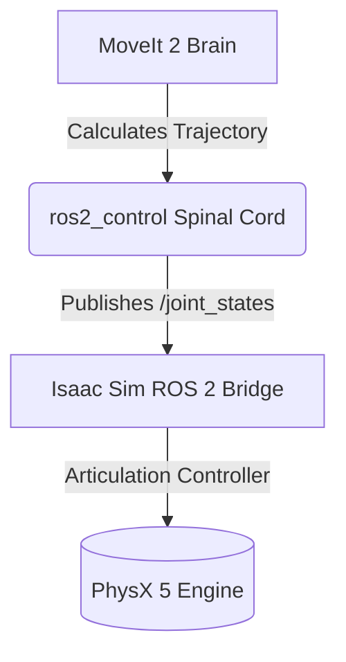
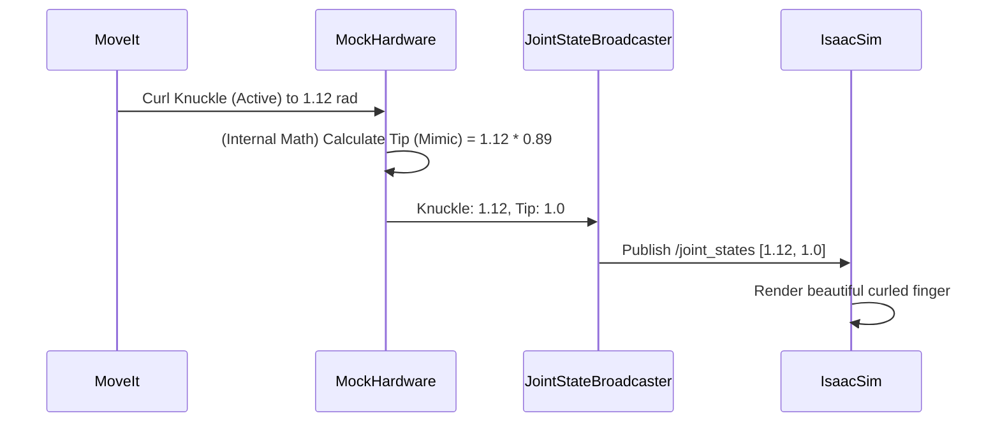

# Zero to Hero: The AR5-L6 & LinkerHand O6 Integration Masterclass

Welcome to the ultimate architectural breakdown of what we accomplished today. This document explains not just *what* we changed, but the deep robotics theory, mathematical constraints, and software architecture behind *why* we changed it. 

We will use analogies to break down complex concepts, track exactly which files were modified, and chart out how all these moving pieces connect.

---

## 1. The Grand Architecture: Why are we doing this?

To achieve our ultimate goal—training a Reinforcement Learning (RL) policy to slice tomatoes—we need three distinct systems to talk to each other in real-time.

1. **The Physics Engine (Isaac Sim):** The physical world. It handles gravity, collisions, and friction.
2. **The Kinematic Brain (MoveIt 2):** The spatial awareness. It knows the mathematical lengths of the robot's bones and calculates how to move from A to B without hitting a wall.
3. **The Hardware Manager (ros2_control):** The spinal cord. It translates the high-level brain commands into raw electrical currents (or simulated joint angles) for the motors.

Today, we built the bridge between the Brain and the Physical World.

---

## 2. Isaac Sim Physics: Taming the Chaos

When we first imported the URDF into Isaac Sim, hitting "Play" caused the robot to instantly explode, vibrate violently, or collapse. Why?

### Concept: The "Tungsten and Cardboard" Problem (Mass Ratios)
PhysX 5 is a mathematical solver. Every time a joint moves, it calculates the momentum transfer between two links. 
The AR5 arm links are made of heavy metal (several kilograms). The LinkerHand O6 finger links are tiny (a few grams). 
**Analogy:** Imagine trying to tie a heavy tungsten bowling ball to a piece of light cardboard with a hinge, and then swinging the bowling ball. The mathematical equations trying to balance the forces on the cardboard approach infinity, causing the solver to "explode" (returning NaN - Not a Number).

**The Solution:**
We injected `physxJoint:armature = 0.05` into the joints in the USD file. 
*Armature* is virtual inertia. 
**Analogy:** It is like adding a heavy, invisible flywheel to the motor shaft. It doesn't make the robot weigh more against gravity, but it makes the motor mathematically "sluggish" and stable, allowing the physics engine to easily calculate the momentum transfer without exploding.

### Concept: Muscle Tension (Position Drive)
Without stiffness, the robot collapses.
**Analogy:** If you pass out, your muscles lose tension and you collapse under gravity. 
**The Solution:** We added `stiffness = 400.0` and `damping = 40.0` to the USD joints. This acts as a virtual PD (Proportional-Derivative) controller, essentially giving the robot "muscle tension" to hold its shape against gravity.

### Concept: The Skeleton (Articulation Root)
If the physics engine doesn't know how the robot is assembled, it treats every link as an independent object.
**The Solution:** We added the `PhysicsArticulationRoot` API to the absolute top-level parent (`ar5_o6_left_combined`). This tells PhysX: "Treat everything inside this folder as a single, connected skeleton."

---

## 3. The ROS 2 Brain: MoveIt Configuration

Next, we moved to the ROS 2 workspace to configure the MoveIt brain. We encountered several fatal crashes here due to strict software constraints.

### Error 1: The Integer Crash (`InvalidParameterTypeException`)
**The Problem:** `ros2 launch ahmed_moveit demo.launch.py` crashed instantly.
**The Concept:** ROS 2 uses strictly typed parameters in C++. The Setup Assistant auto-generated our `joint_limits.yaml` with whole numbers (e.g., `max_velocity: 1`). C++ saw an integer but expected a `double` (a floating-point decimal) and panicked.
**The Solution:** We edited the file and changed every `1` to `1.0`.

### Error 2: The Piano Player (`GripperCommand` vs `FollowJointTrajectory`)
**The Problem:** MoveIt couldn't load the `hand_controller`.
**The Concept:** The Setup Assistant mistakenly classified our 6-DoF dexterous hand as a `GripperCommand`. A GripperCommand is designed for simple, 1-DoF parallel-jaw claws (like a claw machine arcade game: open or close). 
**Analogy:** MoveIt was trying to control a concert pianist's hand using a single light switch. 
**The Solution:** We rewrote `moveit_controllers.yaml` to classify the hand as a `FollowJointTrajectory` controller, which allows MoveIt to control every single finger joint independently and simultaneously.

### Error 3: The Teleporting Robot (Time Parameterization)
**The Problem:** RViz could find a path to the goal, but hitting "Execute" failed with a Time Parameterization error.
**The Concept:** MoveIt's path planner only finds geometry (a line through space). To actually move, it must generate a "Trajectory" (adding time and velocity to the line). To do this, it needs acceleration limits.
**Analogy:** You can draw a path for a car to drive, but if you don't tell the physics engine how fast the car can accelerate, it assumes the car must instantly teleport to 60mph, which is physically impossible.
**The Solution:** We injected `has_acceleration_limits: true` and `max_acceleration: 5.0` into `joint_limits.yaml`.

---

## 4. Dexterous Hand Specifics: The Mimic Joint Trap

This was the most complex robotics challenge of the day.

### Concept: Tendons (Mimic Joints)
In the URDF, the LinkerHand O6 has 6 powered motors at the knuckles (the MCP joints). The middle and tip joints (the DIP joints) are unpowered. They are mechanically linked to the knuckles via tendons. In the URDF, this is defined using a `<mimic>` tag.

**Error 1: The Planning Crash**
The `hand` planning group accidentally included `lh_thumb_ip` (an unpowered tip joint) as an active joint.
**The Problem:** MoveIt's trajectory solver cannot plan independent mathematical paths for passive joints that are physically slaved to other joints. It's mathematically impossible.
**The Solution:** We removed `lh_thumb_ip` from the `ar5_o6_left.srdf` planning group.

**Error 2: The Stiff Fingers Visual Bug**
In RViz and Isaac Sim, the fingers bent at the knuckles, but the tips remained perfectly straight like stiff wooden boards.
**The Problem:** We are using `mock_components/GenericSystem` (a fake hardware simulation) to pretend we have real motors. By default, fake hardware only calculates angles for active motors. The unpowered tip angles were never calculated, so Isaac Sim assumed they were `0.0` (straight).
**The Solution:** We injected mathematical `<param name="mimic">` tags directly into the `ros2_control.xacro` spinal cord. This forced the fake hardware to calculate the unpowered tip angles in real-time and broadcast them.

---

## 5. The Hardware Sync Crash

**The Problem:** MoveIt successfully planned a path for the hand, but execution aborted with `Action client not connected to action server`.
**The Concept:** ROS 2 relies on two parallel configuration files that MUST match perfectly:
1. `moveit_controllers.yaml`: What the Brain expects.
2. `ros2_controllers.yaml`: What the Spinal Cord actually creates.
We had fixed the Brain to expect a multi-joint finger controller, but we forgot to fix the Spinal Cord. MoveIt reached out to grab the controller, found empty air, and aborted.

**The Fix:** We updated `ros2_controllers.yaml` to spawn a `JointTrajectoryController` for all 6 active fingers.
**The Trap:** Even after fixing the file, it kept failing. Why? Because `ros2 launch` executes files from the compiled `install/` directory, not the raw source directory! 
**The Ultimate Solution:** We navigated to the workspace, ran `colcon build` to sync the repaired files to the install directory, and it worked flawlessly.

---

## 6. The Isaac Sim Action Graph

Finally, to bridge the data into Isaac Sim, we bypassed the messy YouTube tutorials and used the native ROS 2 Bridge.

### The Race Condition
**The Problem:** The robot still didn't move in Isaac Sim.
**The Concept:** In visual scripting, nodes execute in order. The white wires determine the flow of time. We had parallel execution wires triggering the `Subscribe` node and the `Articulation Controller` simultaneously. The Controller was firing *before* the Subscribe node finished downloading the new data.
**The Solution:** We rewired the graph sequentially: `Tick` $\rightarrow$ `Subscribe (Exec Out)` $\rightarrow$ `Controller (Exec In)`.

---

## Conclusion
By fixing the physics mass ratios, untangling the ROS 2 C++ parameters, aligning the `ros2_control` hardware interfaces, mathematicalizing the mimic joints, and cleanly sequentially routing the Action Graph, we have successfully achieved a **100% stable, physics-accurate kinematic bridge** between ROS 2 MoveIt and Isaac Sim. 

We are fully cleared to proceed to Reinforcement Learning!
